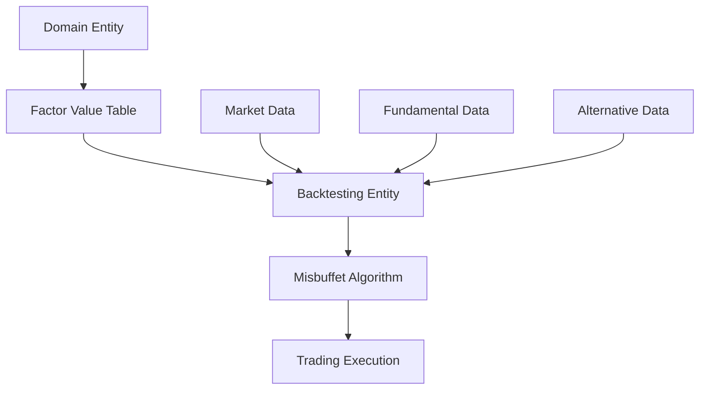

# CLAUDE.md - Financial Backtesting Domain Entities

## 🎯 Overview

This document outlines the comprehensive architecture and processes for domain entities, backtesting entities, and misbuffet entities within the financial backtesting framework following Domain-Driven Design (DDD) principles.

---

## 1. 🏗️ Architecture Overview

The backtesting entities follow a clear hierarchical structure that mirrors the domain entities while adding specialized trading and market functionality:

```
Domain Layer:
├── financial_assets/           # Pure domain entities (minimal functionality)
│   ├── security.py            # Base financial asset class
│   ├── stock.py              # Stock domain entity  
│   ├── bond.py               # Bond domain entity
│   ├── crypto.py             # Cryptocurrency domain entity
│   ├── index.py              # Index domain entity
│   ├── cash.py               # Cash domain entity
│   ├── commodity.py          # Commodity domain entity
│   ├── currency.py           # Currency domain entity
│   ├── equity.py             # Equity domain entity
│   ├── share.py              # Share domain entity
│   ├── etf_share.py          # ETF Share domain entity
│   └── company_share.py      # Company Share domain entity
│
└── back_testing/financial_assets/  # Backtesting-enhanced entities
    ├── security_backtest.py   # Base backtest class with market functionality
    ├── stock_backtest.py      # Stock backtesting with dividends & splits
    ├── bond_backtest.py       # Bond backtesting with yield calculations
    ├── crypto_backtest.py     # Crypto backtesting with staking & volatility
    ├── index_backtest.py      # Index backtesting with constituent tracking
    ├── cash_backtest.py       # Cash backtesting with interest tracking
    ├── commodity_backtest.py  # Commodity backtesting with storage costs
    ├── currency_backtest.py   # Currency backtesting with forex features
    ├── equity_backtest.py     # Equity backtesting with market cap analysis
    ├── share_backtest.py      # Share backtesting with voting rights
    ├── etf_share_backtest.py  # ETF backtesting with NAV tracking
    └── company_share_backtest.py # Company share backtesting with financials
```

---

## 2. 📋 Entity Pattern Structure

### Domain Entities (Simple Structure)
All domain entities follow the established Security/Stock pattern:

```python
from datetime import date
from typing import Optional
from src.domain.entities.finance.financial_assets.security import Security

class EntityName(Security):
    def __init__(self,
                 id: int,
                 start_date: date,
                 end_date: Optional[date]):
        
        super().__init__(id, start_date, end_date)
```

**Key Characteristics:**
- ✅ Minimal imports (datetime, typing, parent class)
- ✅ Simple constructor with basic parameters (id, start_date, end_date)
- ✅ Clean inheritance from Security or appropriate parent
- ✅ DDD-compliant with no complex business logic
- ✅ 12 lines or fewer

### Backtesting Entities (Rich Functionality)
All backtesting entities extend `SecurityBackTest` and provide domain-specific trading functionality:

```python
from src.domain.entities.finance.back_testing.financial_assets.security_backtest import SecurityBackTest
from src.domain.entities.finance.back_testing.financial_assets.symbol import Symbol
from src.domain.entities.finance.back_testing.enums import SecurityType

class EntityNameBackTest(SecurityBackTest):
    def __init__(self, symbol: Symbol):
        super().__init__(symbol)
        # Domain-specific attributes and functionality
        
    def calculate_margin_requirement(self, quantity: Decimal) -> Decimal:
        # Implementation specific to asset type
        
    def get_contract_multiplier(self) -> Decimal:
        # Implementation specific to asset type
```

---

## 3. 🔄 Entity Mapping & Process Flow

### Domain → Backtesting Entity Mapping

| Domain Entity | Backtest Entity | Key Features |
|---------------|-----------------|--------------|
| `Security` | `SecurityBackTest` | Base market data processing, price updates, volatility |
| `Stock` | `StockBackTest` | Dividends, stock splits, sector/industry tracking |
| `Bond` | `BondBackTest` | Yield calculations, duration metrics, coupon payments |
| `Crypto` | `CryptoBackTest` | Staking rewards, network events, enhanced volatility |
| `Index` | `IndexBackTest` | Constituent tracking, rebalancing, sector weights |
| `Cash` | `CashBackTest` | Interest rates, liquidity, zero-margin requirements |
| `Commodity` | `CommodityBackTest` | Storage costs, seasonal patterns, contract specs |
| `Currency` | `CurrencyBackTest` | Forex spreads, carry trades, pip calculations |
| `Equity` | `EquityBackTest` | Market cap analysis, beta calculations, book-to-market |
| `Share` | `ShareBackTest` | Voting rights, ownership tracking, corporate governance |
| `ETFShare` | `ETFShareBackTest` | NAV tracking, premium/discount, basket composition |
| `CompanyShare` | `CompanyShareBackTest` | Financial reporting, earnings, analyst coverage |

### Process Flow Sequence



---

## 4. 📊 Factor Value Integration

### Critical Rule: Factor-Based Data Sourcing

**🚨 IMPORTANT:** All information **NOT** present in the base class parameters will be treated as factors and must be sourced from the **Factor Value Table**.

#### Base Class Parameters (Domain Entities)
For example, `Equity` domain entity has these base parameters:
- `id: int`
- `start_date: date` 
- `end_date: Optional[date]`

#### Factor-Based Data Examples
All other data becomes factors sourced from the Factor Value Table:

**Stock/Equity Factors:**
- Market capitalization → `factor_market_cap`
- P/E ratio → `factor_pe_ratio`
- Dividend yield → `factor_dividend_yield`
- Beta coefficient → `factor_beta`
- Sector classification → `factor_sector`
- Industry group → `factor_industry`
- Book-to-market ratio → `factor_book_to_market`
- Revenue growth → `factor_revenue_growth`
- Debt-to-equity → `factor_debt_to_equity`

**Bond Factors:**
- Credit rating → `factor_credit_rating`
- Yield to maturity → `factor_ytm`
- Duration → `factor_duration`
- Coupon rate → `factor_coupon_rate`
- Call provisions → `factor_callable`

**Crypto Factors:**
- Market cap → `factor_crypto_market_cap`
- Trading volume → `factor_crypto_volume`
- Staking APY → `factor_staking_apy`
- Network hash rate → `factor_hash_rate`
- Supply metrics → `factor_circulating_supply`

### Factor Value Table Schema
```sql
CREATE TABLE factor_values (
    entity_id INT,
    factor_name VARCHAR(255),
    factor_value DECIMAL(18,6),
    factor_date DATE,
    data_source VARCHAR(100),
    PRIMARY KEY (entity_id, factor_name, factor_date)
);
```

---

## 5. 🔧 Misbuffet Integration Architecture

### Core Components

**Algorithm Layer:**
- `IAlgorithm` interface implementations
- Market data processing via `Slice` objects
- Order management through `OrderTicket` system
- Portfolio management and risk controls

**Engine Layer:**
- `IEngine` implementations for backtesting and live trading
- `IDataFeed` for market data streaming
- `ITransactionHandler` for order execution
- `IResultHandler` for performance tracking

**Data Management:**
- `BaseData` derived classes for market data
- `Symbol` system for asset identification
- Resolution-based data subscriptions
- Historical data providers

### Integration Process

1. **Domain Entity Creation** → Simple domain objects with basic parameters
2. **Factor Loading** → Load additional data from Factor Value Table
3. **Backtesting Entity Instantiation** → Rich trading-capable objects
4. **Algorithm Integration** → Misbuffet algorithms consume backtesting entities
5. **Execution** → Trading decisions based on factors and market data

---

## 6. 🎛️ Template Method Pattern Usage

All backtesting entities follow the Template Method pattern established in `SecurityBackTest`:

### Market Data Update Flow
```python
def update_market_data(self, data: MarketData) -> None:
    # Template method defining algorithm flow
    if not self._validate_market_data(data):
        return
        
    self._pre_process_data(data)      # Hook for subclasses
    self._update_price(data)          # Core logic
    self._post_process_data(data)     # Hook for subclasses
    
    # Update caches and history
    self._last_update = data.timestamp
    self._price_history.append(data)
```

### Customization Points
- `_pre_process_data()` - Asset-specific pre-processing
- `_post_process_data()` - Asset-specific post-processing  
- `calculate_margin_requirement()` - Asset-specific margin rules
- `get_contract_multiplier()` - Asset-specific contract sizing

---

## 7. 🔬 Testing Strategy

### Domain Entity Testing
```python
def test_equity_creation():
    equity = Equity(
        id=1,
        start_date=date(2020, 1, 1),
        end_date=date(2023, 12, 31)
    )
    assert equity.id == 1
    assert equity.start_date == date(2020, 1, 1)
```

### Backtesting Entity Testing  
```python
def test_stock_backtest_dividend():
    symbol = Symbol("AAPL", "NYSE", SecurityType.EQUITY)
    stock = StockBackTest(1, "AAPL", 1, datetime.now())
    
    dividend = Dividend(Decimal('0.50'), datetime.now())
    stock.add_dividend(dividend)
    
    assert len(stock.dividend_history) == 1
    assert stock.dividend_history[0].amount == Decimal('0.50')
```

---

## 8. 📈 Performance Considerations

### Memory Management
- Price history limited to last 100 data points
- Lazy loading of factor data
- Efficient decimal arithmetic for financial calculations

### Circuit Breakers
- Price change validation (>50% triggers circuit breaker)
- Volume sanity checks
- Negative price rejection

### Caching Strategy
- Market data cache for recent updates
- Factor value caching with TTL
- Symbol metadata caching

---

## 9. 🚀 Usage Examples

### Creating Domain Entity
```python
equity = Equity(
    id=1001,
    start_date=date(2020, 1, 1),
    end_date=None  # Active security
)
```

### Creating Backtesting Entity with Factors
```python
# Load factors from Factor Value Table
factors = factor_service.load_factors(equity_id=1001, date=today)

# Create backtesting entity
symbol = Symbol("AAPL", "NASDAQ", SecurityType.EQUITY) 
stock_backtest = StockBackTest(1001, "AAPL", 1, datetime.now())

# Apply factor values
stock_backtest.apply_factors(factors)  # Market cap, P/E, sector, etc.
```

### Misbuffet Algorithm Integration
```python
class MyTradingAlgorithm(IAlgorithm):
    def initialize(self):
        # Subscribe to stock with factor-enhanced backtesting
        self.add_equity("AAPL")
        
    def on_data(self, data: Slice):
        # Access factor-enriched stock data
        stock = self.securities["AAPL"]
        
        # Make trading decisions based on factors + market data
        if stock.get_factor("pe_ratio") < 15 and data["AAPL"].price < stock.get_factor("target_price"):
            self.set_holdings("AAPL", 0.1)
```

---

## 10. 🛡️ Best Practices

### Domain Entity Guidelines
- ✅ Keep entities simple and focused on identity
- ✅ Minimal imports and dependencies  
- ✅ Follow consistent constructor patterns
- ❌ Avoid complex business logic in domain entities
- ❌ Never add framework-specific dependencies

### Backtesting Entity Guidelines  
- ✅ Rich functionality for trading scenarios
- ✅ Comprehensive market data processing
- ✅ Asset-specific calculation methods
- ✅ Thread-safe implementations
- ✅ Proper error handling and validation

### Factor Integration Guidelines
- ✅ All non-base parameters must come from factors
- ✅ Factor names follow consistent naming convention
- ✅ Date-aware factor loading
- ✅ Null handling for missing factors
- ❌ Never hardcode fundamental data in entities

---

## 11. 🔮 Future Enhancements

### Planned Improvements
- [ ] Real-time factor streaming integration
- [ ] Machine learning factor generation
- [ ] Cross-asset factor correlation analysis
- [ ] Performance attribution by factor exposure
- [ ] Factor backtesting and validation framework

### Technical Debt Tracking
- [ ] Standardize all margin requirement calculations
- [ ] Implement consistent volatility calculations across assets
- [ ] Add comprehensive unit test coverage
- [ ] Performance optimization for high-frequency scenarios

---

This architecture ensures clean separation between pure domain concepts and rich backtesting functionality while maintaining the flexibility to incorporate complex factor-based data for sophisticated trading strategies.